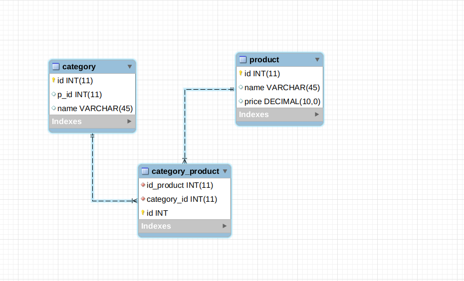
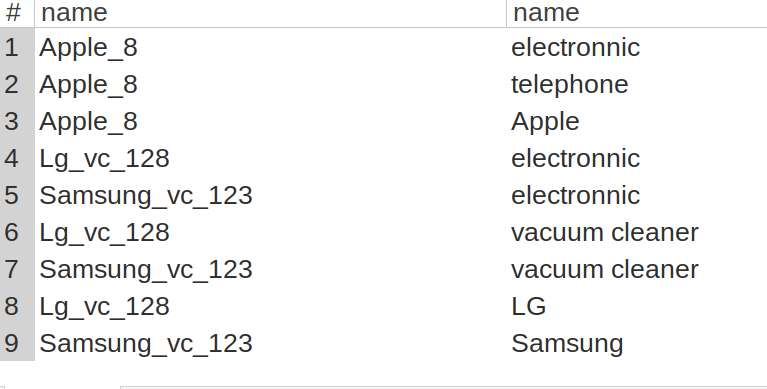
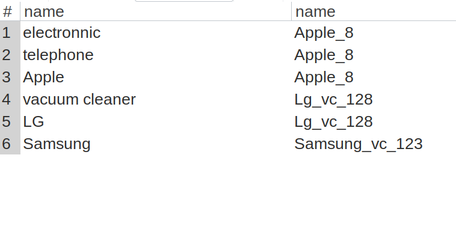
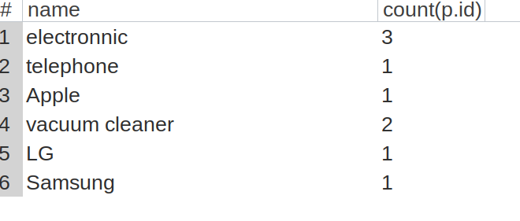

Test Task 
===================

* EventManager 
* Test DB

Test Task Shop DB
--------
1. Create database 

2. Run command `mysql -uroot -p123456 -f mydb < dump.sql`

1. `Select p.name, c.name from shop.product p 
 left join shop.category_product cp
 on cp.id_product = p.id
 left join shop.category c 
 on c.id = cp.id_category;`
 
 

2. 
 `select c.name, p.name from shop.category c
  left join shop.category_product cp
  on cp.id_category = c.id or cp.id_category = c.p_id
  left join shop.product p 
  on p.id = cp.id_product group by cp.id_category`
  
   
  
  
 3. `select c.name,count(p.id) from
         shop.category c
             left join
         shop.category_product cp ON cp.id_category = c.id
             left join
         shop.product p ON p.id = cp.id_product
     group by cp.id_category`
       